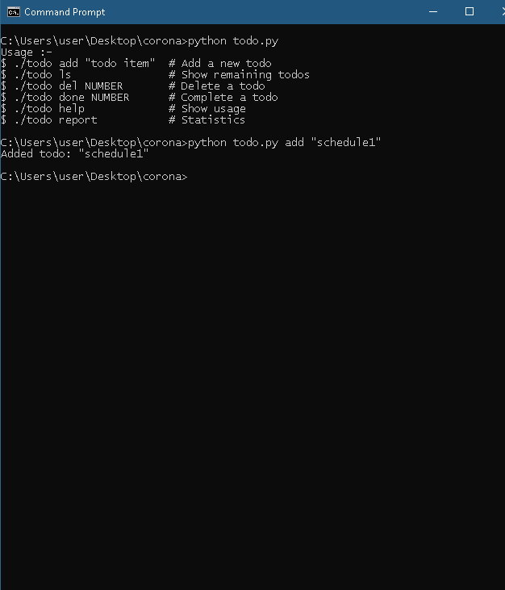

# CoronaSafe Engineering Fellowship Test Problem
## Hey, There Dhanaraj Here , Hope all are fine .
## This is todolist 📜📜📜 app scripted with python 
# Usage  --->>>>running ./todo.py file with 'help' as command line argument  will guide you through usage as follows 

<pre>
<i>
<b>./todo help</b>
Usage :-
./todo add "todo item" # Add a new todo
./todo ls # Show remaining todos
./todo del NUMBER # Delete a todo
./todo done NUMBER # Complete a todo
./todo help # Show usage
./todo report # Statistics
</i>
</pre>
## Sample Screenshot 📸📸📸

# Ping me for any suggestions
# to view more of my project head on to https://github.com/dhanarajappu456
